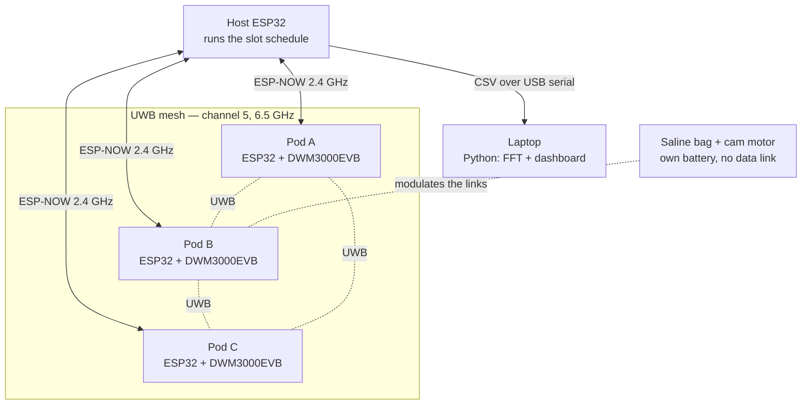
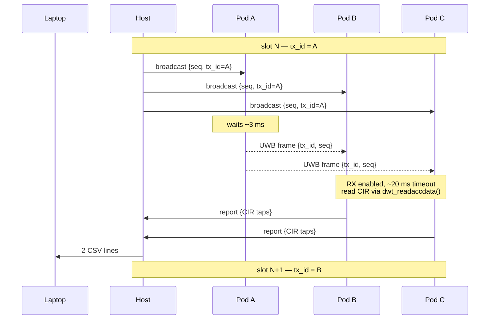
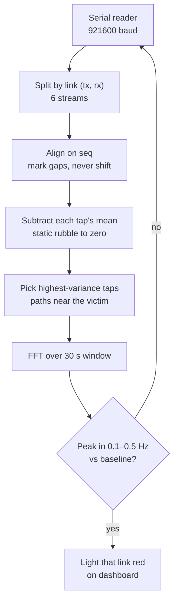

# System Architecture

Diagrams below render automatically on GitHub. No image files, no tooling.

## Components



The saline bag has no wire going anywhere. It is what the system looks at, not
part of the system.

## One slot, step by step

Each slot is 33 ms. The host owns the schedule; all pods run identical
firmware and only `MY_ID` differs.



With 3 pods this gives **6 directed links** (A→B, B→A, A→C, C→A, B→C, C→B).
Direction matters — real motion should appear in both directions of a link,
which is our main false-positive filter.

## Interface contract

**This is the part that breaks a project.** If the firmware's CSV and the
Python parser disagree, nothing works and it wastes an hour. Any change here
gets announced to the whole team.

Firmware report struct:

```c
struct Report {
  uint8_t  rx_id;      // who heard it
  uint8_t  tx_id;      // who sent it
  uint16_t seq;        // which round
  uint8_t  status;     // 0 = OK, 1 = timeout, 2 = error
  uint16_t fp_index;   // first-path position in the CIR
  int16_t  taps[N][2]; // CIR window, I and Q
};
```

One CSV line per report, printed by the host:

```
t_ms, rx_id, tx_id, seq, status, fp_index, I0, Q0, I1, Q1, ... I29, Q29
```

Fixed for now: `N = 30` taps. ESP-NOW caps at 250 bytes, so the ceiling is
about 60 taps.

**Open item:** the taps window should start at an offset from `fp_index`, not
at the first path itself — first-path amplitude is the wrong signal. Make that
offset a `#define` so it can be swept from Python without re-architecting.

## Laptop pipeline



Window is **30 seconds**, not 15. Frequency resolution is `1 / window`, so 30 s
gives 0.033 Hz bins and puts the 0.2 Hz target in bin 6, with the 0.1–0.5 Hz
band spanning bins 3–15. At 15 s the bins double and 0.1 Hz collapses into
bin 1, right against DC where slow drift lives.

## Ownership

| Area | Owner |
|---|---|
| Node timing, TX/RX cycling, CIR read, ESP-NOW | Timothy |
| Serial reader, pipeline, dashboard, plots | host software |
| Puck, mesh lines, demo pile, breathing rig | form factor |
| Repo, docs, architecture, integration | Ian |
